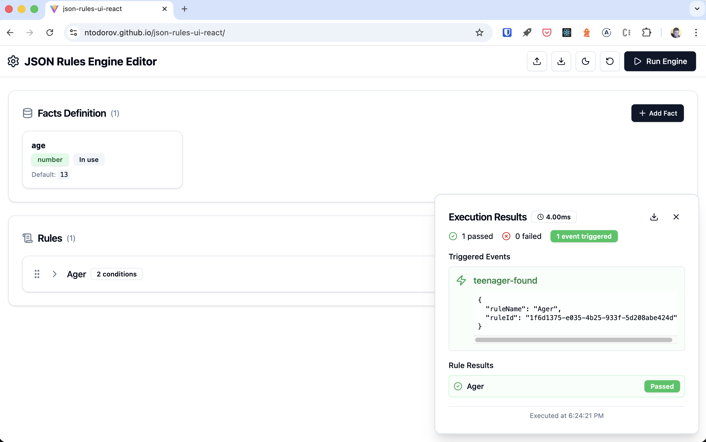
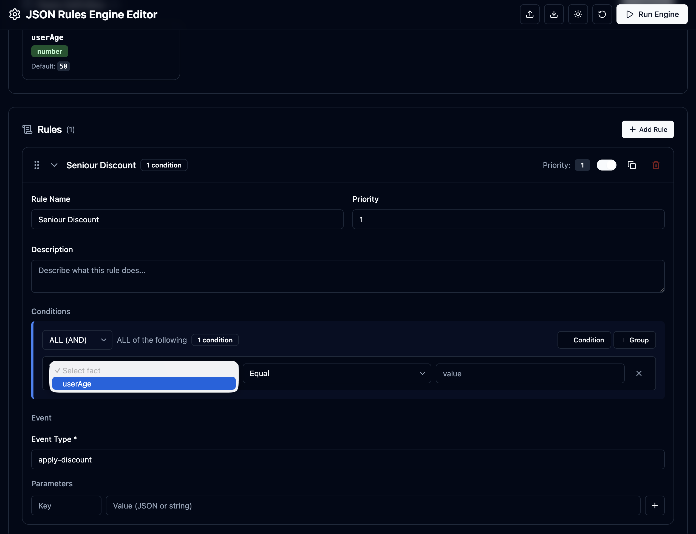

<p align="center">
  
</p>

<h1 align="center">JSON Rules Engine UI</h1>

<p align="center">
  <strong>A beautiful visual editor for creating and testing <a href="https://github.com/CacheControl/json-rules-engine">json-rules-engine</a> rules</strong>
</p>

<p align="center">
  <a href="#demo">Demo</a> •
  <a href="#features">Features</a> •
  <a href="#getting-started">Getting Started</a> •
  <a href="#usage">Usage</a> •
  <a href="#contributing">Contributing</a> •
  <a href="#roadmap">Roadmap</a>
</p>

<p align="center">
  
  
  
  
</p>

---

## 🎯 What is this?

**JSON Rules Engine UI** is a modern, intuitive web application that provides a visual interface for creating, editing, and testing rules using the popular [json-rules-engine](https://github.com/CacheControl/json-rules-engine) library.

Stop writing complex JSON by hand. Build your business rules visually, test them instantly, and export production-ready configurations.

---

## ✨ Demo

👉 **[Try the Live Demo](https://ntodorov.github.io/json-rules-ui-react)**

<p align="center">
  
</p>

<details>
<summary>📸 More Screenshots</summary>

### Dark Mode


### Condition Builder


### Run Results


</details>

---

## 🚀 Features

### Core Features
- **📝 Visual Rule Builder** — Create complex rules with nested conditions using an intuitive drag-and-drop interface
- **🎯 Fact Management** — Define your facts with types, defaults, and descriptions
- **🔄 Condition Groups** — Build sophisticated logic with `ALL`, `ANY`, and `NOT` operators
- **▶️ Live Testing** — Run your rules instantly with custom fact values
- **📊 Results Visualization** — See exactly which rules triggered and why

### Developer Experience
- **💾 Import/Export** — Save and load your rule configurations as JSON
- **🌙 Dark Mode** — Easy on the eyes with automatic theme detection
- **📱 Responsive** — Works on desktop and tablet devices
- **⚡ Fast** — Built with Vite and React 19 for blazing performance
- **💪 Type-Safe** — Full TypeScript support

### All Operators Supported
| Type | Operators |
|------|-----------|
| **Number** | `equal`, `notEqual`, `lessThan`, `lessThanInclusive`, `greaterThan`, `greaterThanInclusive`, `in`, `notIn` |
| **String** | `equal`, `notEqual`, `in`, `notIn`, `contains`, `doesNotContain` |
| **Boolean** | `equal`, `notEqual` |
| **Array** | `contains`, `doesNotContain` |
| **Object** | `equal`, `notEqual` (with JSON path support) |

---

## 📦 Getting Started

### Prerequisites

- Node.js 18+ 
- npm, yarn, or pnpm

### Installation

```bash
# Clone the repository
git clone https://github.com/ntodorov/json-rules-ui-react.git
cd json-rules-ui-react

# Install dependencies
npm install

# Start the development server
npm run dev
```

Open [http://localhost:5173](http://localhost:5173) to see the app.

### Build for Production

```bash
npm run build
```

The production build will be in the `dist` folder.

---

## 📖 Usage

### 1. Define Your Facts

Facts are the data points your rules will evaluate. Click **"+ Add Fact"** and specify:
- **Name**: Unique identifier (e.g., `userAge`, `orderTotal`)
- **Type**: `string`, `number`, `boolean`, `array`, or `object`
- **Description**: Optional documentation

### 2. Create Rules

Each rule consists of:
- **Conditions**: When should this rule fire?
- **Event**: What happens when conditions are met?
- **Priority**: Higher priority rules execute first

### 3. Build Conditions

Use the visual condition builder to create complex logic:

```
ALL of:
  ├── age >= 18
  └── ANY of:
        ├── country = "US"
        └── country = "CA"
```

### 4. Test Your Rules

Click **"Run Engine"**, enter test values for your facts, and see:
- Which events were triggered
- Detailed results for each rule
- Condition evaluation breakdown

### 5. Export & Use

Export your configuration and use it directly with json-rules-engine:

```javascript
import { Engine } from 'json-rules-engine';

// Load your exported config
const config = require('./my-rules.json');

const engine = new Engine();

// Add rules from your export
config.rules.forEach(rule => engine.addRule(rule));

// Run with facts
const { events } = await engine.run(facts);
```

---

## 🛠 Tech Stack

| Technology | Purpose |
|------------|---------|
| [React 19](https://react.dev) | UI Framework |
| [TypeScript](https://typescriptlang.org) | Type Safety |
| [Vite](https://vite.dev) | Build Tool |
| [Tailwind CSS](https://tailwindcss.com) | Styling |
| [Zustand](https://zustand-demo.pmnd.rs) | State Management |
| [json-rules-engine](https://github.com/CacheControl/json-rules-engine) | Rules Engine |
| [Framer Motion](https://www.framer.com/motion) | Animations |
| [React Hook Form](https://react-hook-form.com) | Form Handling |
| [Zod](https://zod.dev) | Validation |

---

## 🤝 Contributing

Contributions are what make the open-source community amazing! Any contributions you make are **greatly appreciated**.

### How to Contribute

1. **Fork** the repository
2. **Create** your feature branch (`git checkout -b feature/amazing-feature`)
3. **Commit** your changes (`git commit -m 'Add amazing feature'`)
4. **Push** to the branch (`git push origin feature/amazing-feature`)
5. **Open** a Pull Request

### Development Guidelines

- Follow the existing code style
- Add tests for new features
- Update documentation as needed
- Keep PRs focused and small

### Good First Issues

Look for issues labeled [`good first issue`](https://github.com/ntodorov/json-rules-ui-react/labels/good%20first%20issue) — these are great for newcomers!

---

## 🗺 Roadmap

### Coming Soon
- [ ] 📋 Rule templates library
- [ ] 🔙 Undo/Redo support  
- [ ] 🧪 Batch testing with multiple test cases
- [ ] 📊 Visual rule dependency graph
- [ ] 💻 Code generation (JavaScript/TypeScript)

### Future Ideas
- [ ] 🔌 Custom operator plugins
- [ ] 🌐 API integration (save/load from backend)
- [ ] 👥 Real-time collaboration
- [ ] 📝 Natural language condition preview
- [ ] 🎨 Custom themes

Have an idea? [Open a feature request!](https://github.com/ntodorov/json-rules-ui-react/issues/new)

---

## 🌍 Deployment

### GitHub Pages (Free)

This project includes built-in GitHub Pages support:

```bash
# Build and deploy to GitHub Pages
npm run deploy
```

Or set up automatic deployment via GitHub Actions (see `.github/workflows/deploy.yml`).

### Other Free Hosting Options

| Platform | Deploy Button |
|----------|---------------|
| **Vercel** | [](https://vercel.com/new/clone?repository-url=https://github.com/ntodorov/json-rules-ui-react) |
| **Netlify** | [](https://app.netlify.com/start/deploy?repository=https://github.com/ntodorov/json-rules-ui-react) |
| **Cloudflare Pages** | Connect your repo at [pages.cloudflare.com](https://pages.cloudflare.com) |
| **Railway** | One-click deploy at [railway.app](https://railway.app) |

---

## 📄 License

Distributed under the **MIT License**. See `LICENSE` for more information.

---

## 🙏 Acknowledgments

- [json-rules-engine](https://github.com/CacheControl/json-rules-engine) — The powerful rules engine this UI is built for
- [Lucide Icons](https://lucide.dev) — Beautiful open-source icons
- [Tailwind CSS](https://tailwindcss.com) — Utility-first CSS framework

---

<p align="center">
  Made with ❤️ by <a href="https://github.com/ntodorov">ntodorov</a>
</p>

<p align="center">
  <a href="https://github.com/ntodorov/json-rules-ui-react">⭐ Star this repo</a> if you find it useful!
</p>
